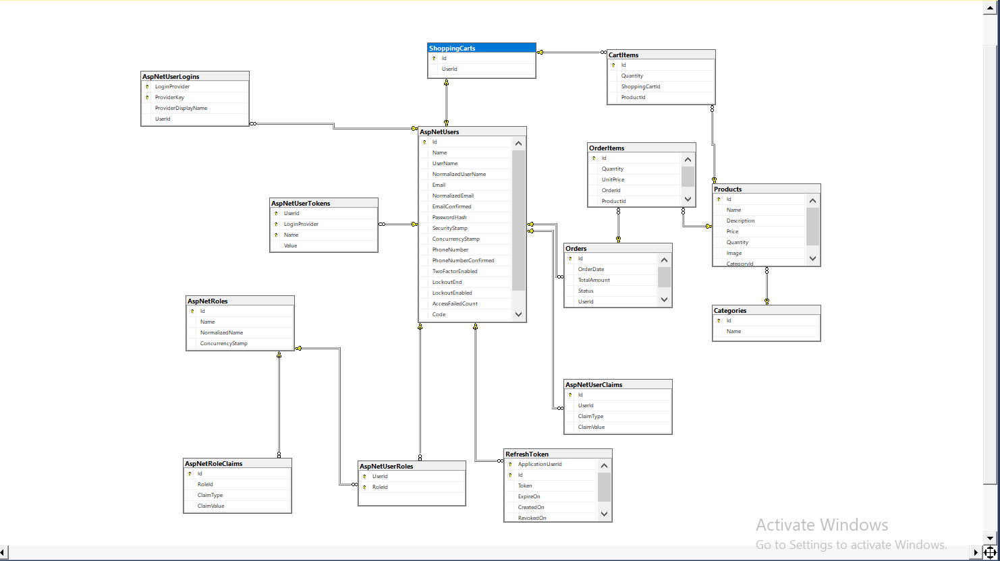
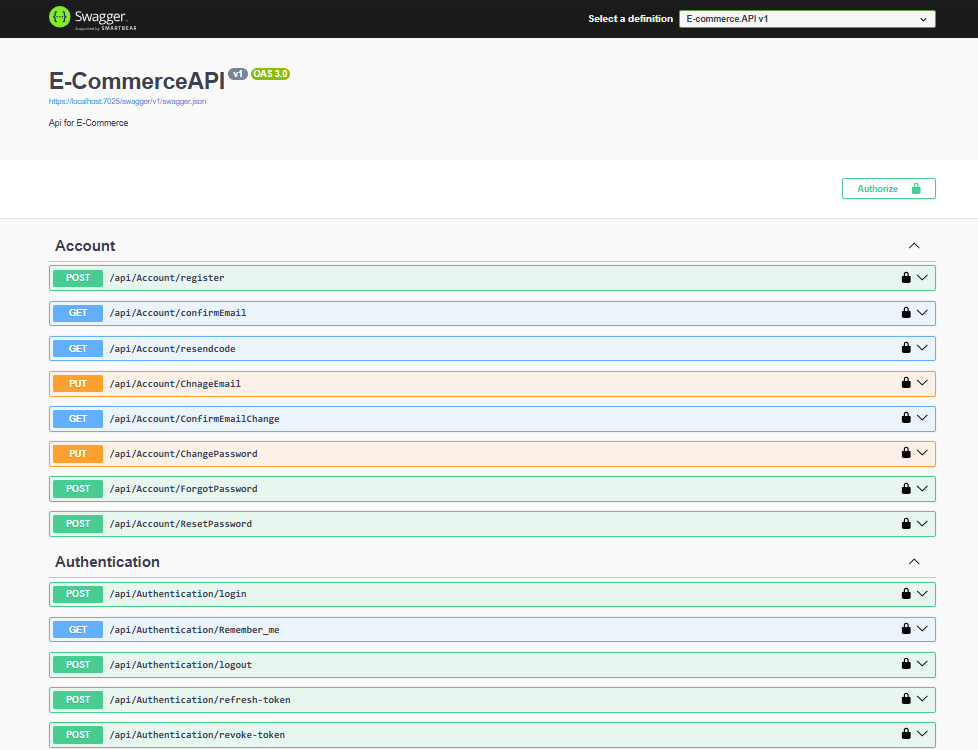

# 🛒 E-Commerce API

E-Commerce Web API built with ASP.NET Core following Onion Architecture principles.

---

## 🚀 Features

- Authentication & Authorization (JWT + Refresh Token)
- Account Management (Register, Confirm Email, Reset Password)
- Category
- Product
- Shopping Cart
- Orders & Order Items
- Role & Permission Management
- Search & Filtering

---

## 🛠️ Technologies Used

- ASP.NET Core Web API
- Entity Framework Core
- SQL Server
- JWT Authentication
- Refresh Tokens
- Role-Based Authorization
- Onion Architecture

---

## 📌 Overview

- Built a scalable RESTful API using ASP.NET Core 8 and Onion Architecture using Generic Repository. 
- Secured API with JWT authentication & authorization using ASP.NET Core Identity.
- Designed and implemented secure account management workflows including email verification, 
  resend confirmation codes, email change validation, and password reset functionality.
- Complete Product, Category, Cart , Order & Checkout workflow.
- Using AutoMapper integrated for mapping between entities & DTOs.
- Implemented Localization & Globalization (multi-language and culture support).

---

## 📸 Project Screenshots

## 🗄️ Database Diagram

### 👤 Account & Authentication

### 🗂️ Category & Orders

### 📦 Products , Roles & Shopping Cart

---
